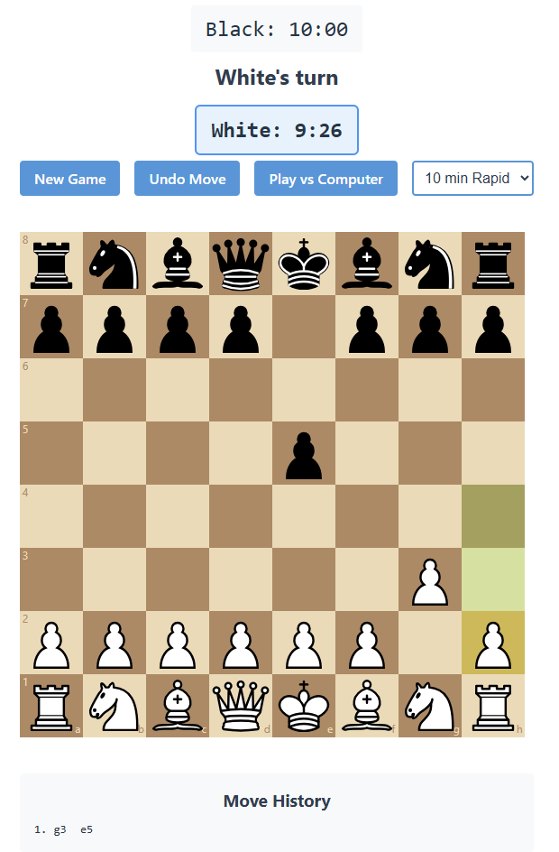
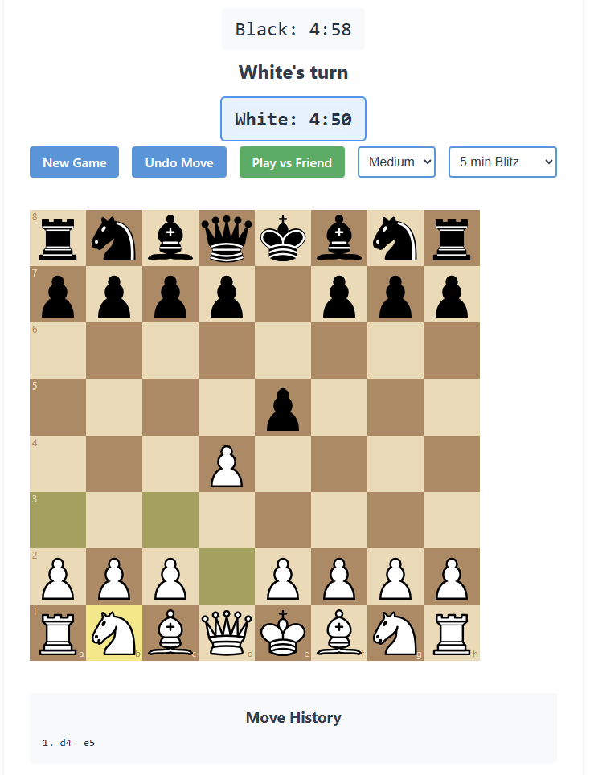

# Chess Game

A full-featured chess game built with React, featuring a computer opponent with multiple difficulty levels and time controls.

## Live Demo

🎮 [Play the game here](https://menawang.github.io/ChessGame)

## Game Preview

### Player vs Player Mode

- Classic chess gameplay
- Professional chess clock
- Multiple time control options
- Move validation and legal moves highlighting

### Player vs Computer Mode

- Three AI difficulty levels
- Adaptive computer opponent
- Visual move suggestions
- Time controls with increment support

## Technology Stack
- **React** - Frontend framework for building the user interface
- **TypeScript** - Static typing for improved code reliability
- **chess.js** - Chess logic and move validation
- **react-chessboard** - Chessboard UI component
- **Position Tables** - Pre-calculated piece-square tables for positional evaluation
- **Timer System** - Custom implementation with increment support

## Features

### Game Modes
- Player vs Player
- Player vs Computer with three difficulty levels:
  - Easy (3 seconds per move)
  - Medium (2 seconds per move)
  - Hard (1 second per move)

### Time Controls
- 1 min Bullet (60 seconds)
- 3 min Blitz (180 seconds)
- 5 min Blitz (300 seconds)
- 10 min Rapid (600 seconds)
- 15|10 Rapid (900 seconds + 10 second increment)

### Computer Opponent Levels

#### Easy Mode
- **Thinking Time:** 3 seconds
- **Characteristics:**
  - Basic material counting
  - Simple tactical awareness
  - High randomization (50% factor)
  - Focus on immediate captures
- **Technical Implementation:**
  - **Material Evaluation:**
    - Pure piece values without context
    - Basic capture evaluation (MVV-LVA)
    - No positional bonuses
    - Simple piece mobility (+5 points per legal move)
  - **Move Selection:**
    - Evaluates immediate captures first
    - Considers basic piece development
    - Random selection from top 5 moves
    - No lookahead/depth search
  - **Randomization:**
    - 50% chance to select sub-optimal moves
    - Helps simulate beginner-level play
    - Avoids obvious blunders
- **Example Position:**
```
8 ♜ . . ♛ ♚ ♝ . ♜
7 ♟ ♟ ♟ . . ♟ ♟ ♟
6 . . ♞ . . ♞ . .
5 . . . ♟ ♟ . . .
4 . . ♗ ♙ ♙ . . .
3 . . . . . . . .
2 ♙ ♙ ♙ . . ♙ ♙ ♙
1 ♖ ♘ ♗ ♕ ♔ . ♘ ♖
```
In this position, Easy mode:
- Recognizes the basic material count is even
- Sees immediate captures (if any)
- Considers simple piece development
- May miss tactical opportunities like pins or forks
- Focuses on single-move threats

#### Medium Mode
- **Thinking Time:** 2 seconds
- **Characteristics:**
  - Material evaluation with context
  - Position-based decision making
  - Moderate randomization (20% factor)
  - Basic opening principles
- **Technical Implementation:**
  - **Position Evaluation:**
    - Material counting with basic positional context
    - Center control bonus (+5 points per central square)
    - Basic pawn structure evaluation
      - Doubled pawns (-10 points)
      - Isolated pawns (-10 points)
    - Simple king safety assessment
      - Castling bonus (+30 points)
      - Pawn shield evaluation (+5 per protecting pawn)
  - **Opening Knowledge:**
    - Basic development principles
    - Simple center control strategy
    - King safety consideration
  - **Tactical Awareness:**
    - Identifies basic combinations
    - Recognizes common patterns
    - Limited positional sacrifices
- **Example Position:**
```
8 . . . ♜ . ♜ ♚ .
7 ♟ . . . . ♟ ♟ ♟
6 . ♟ . . . ♞ . .
5 . . . ♝ ♟ . . .
4 . . . ♙ ♘ . . .
3 . . ♙ . . . . .
2 ♙ ♙ . . . ♙ ♙ ♙
1 ♖ . . . . ♖ ♔ .
```
In this position, Medium mode analyzes:
- Material balance (equal material)
- Piece coordination (knight and bishop positioning)
- Basic pawn structure assessment
- King safety evaluation
- Control of central squares
- Potential piece exchanges

#### Hard Mode
- **Thinking Time:** 1 second
- **Characteristics:**
  - Sophisticated positional evaluation
  - Strong tactical awareness
  - Minimal randomization (5% factor)
  - Advanced opening principles
- **Technical Implementation:**
  - **Positional Understanding:**
    - Center control (both central and extended center)
    - Piece mobility and coordination
    - Advanced pawn structure evaluation
    - Sophisticated king safety assessment
  - **Opening Principles:**
    - Prioritizes piece development
    - Strong center control (+10 points per central square)
    - Early king safety (castling bonus)
    - Restricted early queen moves (penalty for premature queen development)
  - **Endgame Knowledge:**
    - King activation in endgames
    - Passed pawn evaluation
    - Opposition understanding
    - Drawing techniques
- **Example Position:**
```
8 . . . ♜ . . ♚ .
7 . . . . . ♟ ♟ ♟
6 ♟ . . . ♟ . . .
5 . ♟ . . ♙ . . .
4 ♙ . . . . . . .
3 . ♙ . . . ♘ . .
2 . . . . . ♙ ♙ ♙
1 . . . ♖ . . ♔ .
```
In this endgame position, Hard mode analyzes:
- Passed pawn potential on a-file
- King activation opportunities
- Rook positioning for maximum activity
- Knight centralization prospects
- Pawn structure dynamics

The engine evaluates positions using:
- Material balance
- Piece-square table values
- Pawn structure analysis
- King safety (adjusted for endgame)
- Mobility and control of key squares

### Technical Implementation Details

#### Position Evaluation
- **Material Values:**
  - Pawn: 100
  - Knight: 320
  - Bishop: 330
  - Rook: 500
  - Queen: 900
  - King: 20000 (for safety evaluation)

#### Positional Bonuses
- Piece-square tables for all pieces
- Dynamic position evaluation based on game phase
- Special evaluation for:
  - Doubled pawns (-20 points)
  - Isolated pawns (-15 points)
  - Passed pawns (+50 points)
  - Center control (+10 points per central square)
  - Extended center control (+5 points per square)

#### Move Selection Process
1. Generate all legal moves
2. Evaluate each move based on difficulty level
3. Apply appropriate randomization factor
4. Select from top moves based on difficulty:
   - Easy: Top 5 moves
   - Medium: Top 3 moves
   - Hard: Top 2 moves

## Getting Started

1. Clone the repository
2. Install dependencies:
   ```bash
   npm install
   ```
3. Run the development server:
   ```bash
   npm start
   ```

## How to Play

1. Select game mode (vs Friend or vs Computer)
2. If playing against computer, choose difficulty level
3. Select time control
4. Make moves by either:
   - Clicking pieces and valid squares
   - Dragging and dropping pieces
5. Use the control buttons to:
   - Start a new game
   - Undo moves
   - Switch game modes

## Contributing

Feel free to submit issues and enhancement requests!
